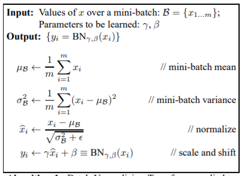

# Batch Normalization

## Batchnorm 解决的问题

深度学习的话尤其是在CV上都需要对数据做归一化，因为深度神经网络主要就是为了学习训练数据的分布，并在测试集上达到很好的泛化效果，但是，如果我们每一个 batch 输入的数据都具有不同的分布，显然会给网络的训练带来困难。另一方面，数据经过一层层网络计算后，其数据分布也在发生着变化，此现象称为 Internal Covariate Shift，会给下一层的网络学习带来困难。batchnorm 就是为了解决这个分布变化问题。

Internal Covariate Shift：google小组在论文 [Batch Normalization](https://arxiv.org/abs/1502.03167) 中提出来的，其主要描述的是：训练深度网络的时候经常发生训练困难的问题，因为，每一次参数迭代更新后，上一层网络的输出数据经过这一层网络计算后，数据的分布会发生变化，为下一层网络的学习带来困难（神经网络本来就是要学习数据的分布，要是分布一直在变，学习就很难了），此现象称之为 Internal Covariate Shift。Internal Covariate Shift 之前的解决方案就是使用较小的学习率，和亲身进行参数初始化，对数据做白化处理，但是治标不治本。

## Batchnorm 原理

Batchnorm 就是对每一层的输入数据进行归一化，不过如果每一层都归一化到均值为 0，方差为 1 的标准分布中，就会导致网络学习不到输入数据的特征，所以 Batchnorm 对此稍作了修改，使得最后的输出是均值为 $\beta$，方差为 $\gamma$ 的正态分布。算法原理如图 1 所示

 
图1 Batchnorm 算法原理 (论文截图)

1. 先求出此 batch 数据 $x$ 的均值，
2. 求出此次 batch 的方差
3. 接下来就是对 $x$ 做归一化，得到 $\hat x$
4. 最重要的一步，引入缩放和平移变量 $\gamma$ 和 $\beta$ ,计算归一化后的值 $y_i = \gamma \hat x_i + \beta$

对于额外的两个参数 $\gamma$ 和 $\beta$，之前也说过如果直接做归一化不做其他处理，神经网络是学不到任何东西的，但是加入这两个参数后，事情就不一样了。先考虑特殊情况下，如果 $\gamma$ 和 $\beta$ 分别等于此 batch 的标准差和均值，那么 $y_i = x_i$，即缩放平移到了归一化前的分布，相当于 batchnorm 没有起作用。$ \beta$ 和 $\gamma$ 分别称之为平移参数和缩放参数。这样就保证了每一次数据经过归一化后还保留的有学习来的特征，同时又能完成归一化这个操作，加速训练。

参考 [https://blog.csdn.net/qq_25737169/article/details/79048516](https://blog.csdn.net/qq_25737169/article/details/79048516)

## Batchnorm 源码解析

## Batchnorm 优点
没有它之前，需要小心的调整学习率和权重初始化，使用了了 Batchnorm 可以放心的使用大学习率，不用小心的调参了，较大的学习率极大的提高了学习速度。

Batchnorm 本身上也是一种正则的方式，可以代替其他正则方式如 dropout 等。

另外，batchnorm 降低了数据之间的绝对差异，有一个去相关的性质，更多的考虑相对差异性，因此在分类任务上具有更好的效果。