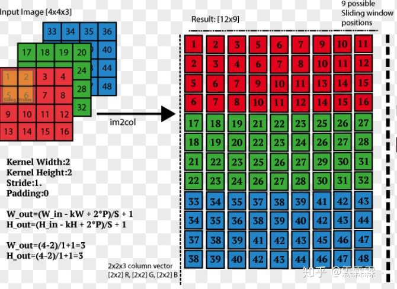

# Convolution

##  Conv1D

以 pytorch 为例，网络中添加conv算子的定义如下
`import torch`
`torch.nn.Conv1d(in_channels, out_channels, kernel_size, stride=1, padding=0, dilation=1, groups=1, bias=True, padding_mode='zeros')`

其中，各参数的含义为:
`input_chnnels`、`ouput_channels`输入输出的通道数；

`kernel_size` 卷积核的大小；

`stride` 卷积核滑动步长；

`padding` padding的大小；

`dilation` 空洞卷积参数，值为1时表示普通卷积，值大于1时，表示卷积核中每个卷积元素的感受野为 `2*dilation-1`，整体卷积核的感受野为 `(kernel_size +1)*dilation-1`，具体可以参考[空洞卷积](https://blog.csdn.net/hao1994121/article/details/88371685)。

`groups` 卷积分组，将输入channel分组进行卷积，可以减小参数量和计算量，同时不影响输入输出shape，参考[分组卷积](https://www.jianshu.com/p/20150e44bde8)。

`bias` 是否有bias。

`padding_mode` `zeros`，`reflect`，`replicate` 或者 `circular`，一般默认 `zeros`，即补0。想了解各模式下的具体操作，可以参考[Padding Layer](https://pytorch.org/docs/master/nn.html#padding-layers)

在`Conv1D`中，输入输出数据均为3维 (n,c,l)，n 表示 batch_size，c 表示通道数， l 表示输入数据中一个序列的长度。

在pytorch中，Conv1D是看作Conv2D来处理的。前向反向传播细节参考 `Conv2D`。

##  Conv2D

在`Conv2D`中，输入输出数据均为 4 维 (n,c,h,w)。其中 kernel 可以为 int 也可为 tuple，为 tuple 时可以设置高宽不同的 kenel，比如 kenel = (3,5)。 `Forward` 与 `Backward` 的参考了 [pytorch conv2D](https://zhuanlan.zhihu.com/p/83517817)。

### Forward

forward 函数主要参考 aten/src/ATen/native/ConvolutionMM2d.cpp 下的 slow_conv2d_forward_cpu。主要思想是将 shape 为 (inC, inH, inW) 的 input im2col成 shape 为 (inC * kh * kw, oW * oH) 的数据 fInput，将卷积 knnel 的 weight reshape 成 (oC, inC * kh * kw) 的 weightView，然后直接进行矩阵乘法操作 $weightView \times fInpout$，得到 shape 为 (oC, oH * oW)，然后将其 reshape 为 (oC, oH, oW)，即为一个 batch 的 output。整体如图所示

### Backword
思想来源于 DNN 的 [`backward`](./dnn.md)。backward 函数主要参考 aten/src/ATen/native/ConvolutionMM2d.cpp 下的 slow_conv2d_backward_cpu。

按照 DNN 的思想，我们需要根据输出 (shape (b, oC, oH, oW)) 的梯度获取输入 (shape (b, in_c, in_h, in_w) ) 的梯度。在 `Forward` 中，我们已经将卷积操作转化为了如 DNN 中的全连接操作，在反向传播的过程中，仍然是将其转化为诸如 DNN 操作一样。先忽略 batch，首先将输出的梯度 gradO (oC, oH, oW) reshape 为 gradOR (oC, oW*oW)，那么

$gradFinput = \frac{\delta E}{\delta fInput} = weightView \times gradOR$

再对 gradFinput 执行 im2col 的逆操作，即可可得到 gradIn，实现了偏导之间的层层传播。

$\delta(weightView) = gradOR \times fInput^T$ 
$\delta(b) = \sum_{r=1}^{oH*oW}gradO$

##  Conv3D

在 `Conv3D` 中，输入输出数据均为 5 维 (n,c,h,w)。同时 kernel 如果3个维度大小不一，如 (3,4,5)，则其shape必须为 (3,)。

<!--stackedit_data:
eyJoaXN0b3J5IjpbLTE3MzYyMzEyMTUsMTY3MDQ4Mzg5MywxNz
UxMTEzODQ0LC05NzY2MTU4MzcsMTQ4MTkzMDI2MywtMTc1ODAw
NTg1MCwtMTcwMTc3NDA0NSwxMDEwMjczOTY2XX0=
-->