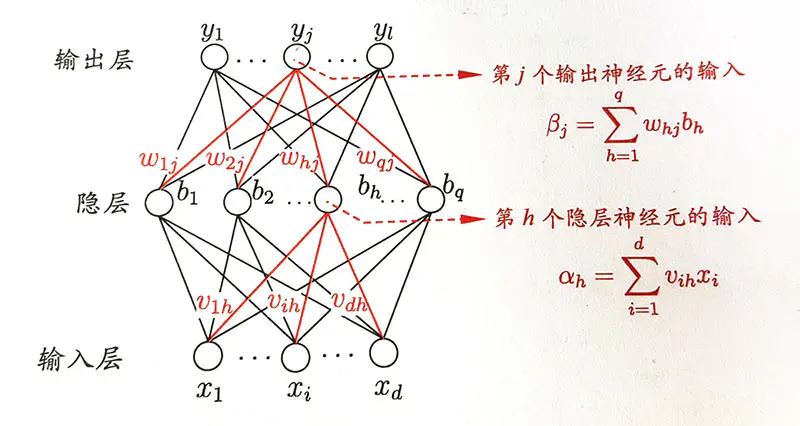

# DNN
如图所示为包含一个隐层的 `DNN` 结构,当然实际应用中可以包含多个隐层，但是一般隐层数目不会超过5，因为 `DNN` 的激活函数是 `sigmoid`，反向传播时有梯度消失的问题。

## Forward

前向传播比较简单，对于隐层，隐层神经元 `h` 的输入如图所示为 ${\alpha}_h = \sum_{i=1}^d{x_i}$，那么该神经元的值为$b_h = sigmoid({\alpha}_h)$，各层的以此类推。

## Backward
不一定所有的激活函数都是 $sigmoid$，所以这里将激活函数设为 $\sigma$。
假设损失函数
$E=\sum_{i=1}^d\frac{1}{2}(y_i-y_i')^2$

$\delta_j^2=\frac{\delta{E}}{\delta{\beta_j}}$=$\frac{\delta{E}}{\delta{y_j}}\frac{\delta{y_j}}{\delta{\beta}_j}$

$\frac{\delta{E}}{\delta{w_{jh}}}$=$\frac{\delta{E}}{\delta{y_j}}\frac{\delta{y_j}}{\delta{\beta}_j}\frac{{\delta{\beta}_j}}{\delta{w_{jh}}}=\delta_j^2\frac{{\delta{\beta}_j}}{\delta{w_{jh}}}=\delta_j^2b_h$

$\frac{\delta{E}}{\delta{b_h}} =\sum_{j=1}^l\frac{\delta{E}}{\delta{\beta}_j}w_{jh} =\sum_{j=1}^l\delta^2_jw_{jh}= w_h^T\times\delta^2$

$\frac{\delta{E}}{\delta\alpha_h} =w_h^T\times{\delta}^2\sigma^{'}({b_h})$

$\delta^1=\frac{\delta{E}}{\delta\alpha} = w^T\times{\delta}^2\sigma^{'}({b_h})$ 

其中 $\delta$ 的上标代表的时网络中的层数。如果网络中有偏置量，则偏置向量的梯度为当前层的 $\delta$，这个比较好理解，因为神经元的输入值相对于偏置的导数为 1。整个过程之中运用了链式求导法则。

由上述推导过程可以得出层与层之间偏导的关系，就可以逐层递推求得各层的偏导以及权重梯度。在根据梯度更新权重值时，$w=w-\eta\frac{\delta{E}}{\delta{w}}$，$\eta$ 是学习率。

