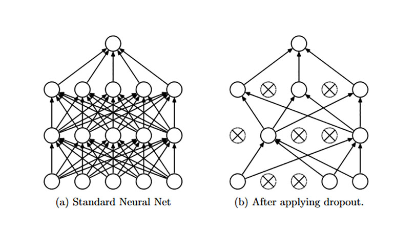

# Dropout

Dropout 指以概率 p 舍弃神经元并让其它神经元以概率 q=1-p 保留，来达到防止过拟合的目的。每个神经元被关闭的概率是相同的。如图 1 所示。

 
图1 Dropout

Dropout 可以防止过拟合的原因主要有三点。一是取平均的作用。Dropout 掉不同的隐藏神经元就类似在训练不同的网络，整个dropout过程就相当于对很多个不同的神经网络取平均。二是减少神经元之间复杂的共适应关系。在标准神经网络中，每个参数接收的导数表明其应该如何变化才能使最终损失函数降低，并给定所有其它神经网络单元的状态。因此神经单元可能以一种可以修正其它神经网络单元错误的方式进行改变。而这就可能导致复杂的共适应(co-adaptations)。由于这些共适应现象没有推广到未见的数据，将导致过拟合。我们假设对每个隐藏层的神经网络单元，Dropout通过使丢弃掉其它隐藏层神经网络单元从而阻止共适应的发生。因为dropout程序导致两个神经元不一定每次都在一个dropout网络中出现。这样权值的更新不再依赖于有固定关系的隐含节点的共同作用，阻止了某些特征仅仅在其它特定特征下才有效果的情况 。迫使网络去学习更加鲁棒的特征 ，这些特征在其它的神经元的随机子集中也存在。换句话说假如我们的神经网络是在做出某种预测，它不应该对一些特定的线索片段太过敏感，即使丢失特定的线索，它也应该可以从众多其它线索中学习一些共同的特征。从这个角度看dropout就有点像L1，L2正则，减少权重使得网络对丢失特定神经元连接的鲁棒性提高。三是 dropout 类似于性别在生物进化中的角色。物种为了生存往往会倾向于适应这种环境，环境突变则会导致物种难以做出及时反应，性别的出现可以繁衍出适应新环境的变种，有效的阻止过拟合，即避免环境改变时物种可能面临的灭绝。

## Inverted Dropout

Forward：
$X = Bernoulli(1-p)$
$Output = X·Input/(1-p)$
$output1 = \sigma (W \times Output + bias)$

Backward：
$gradInput = gradOutput * (X.type_as(gradOutput) * (1. / (1-p)))$

其中，p 是每个单元被舍弃的概率，Input 是 dropout 的输入，output 是对应的输出。output 中除以 (1-p) 是对结果进行了缩放。如果在训练时没有使用 (1-p) 的缩放，就需要在测试时对 W 进行缩放，且 $W_{test} = pW$。

一般情况下是在训练时对 output 进行缩放，pytorch 中就是这么做的。Inverted Dropout 是目前应用比较广泛的一种 dropout 方式，各大主流框架下的默认 dropout 都是 Inverted Dropout。

## Alpha Dropout

一般和 selu 激活函数配合使用

## Feature Dropout

