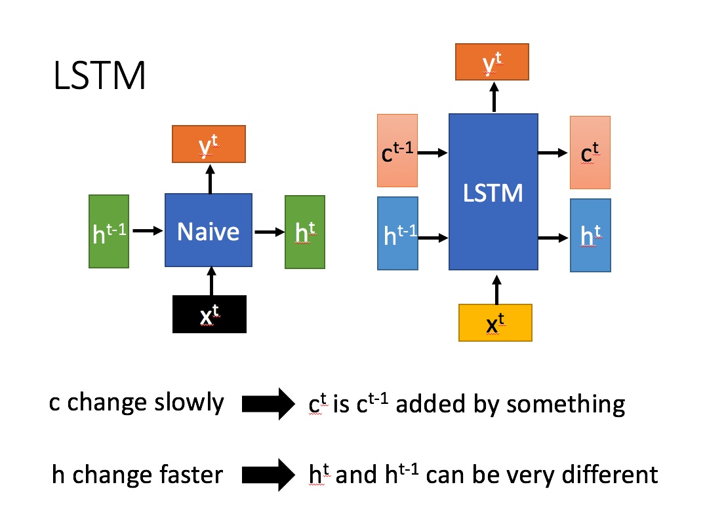

# LSTM

## RNN

RNN (Recurrent Neural Network，循环神经网络) 的简图如下，

RNN其中一个单元的细节如下图，

$x$ 为当前状态下数据的输入，  $h$  表示接收到的上一个节点的输入。

$y$  为当前节点状态下的输出，而   $h'$ 为传递到下一个节点的输出。

通过上图的公式可以看到，输出 $h'$ 与  $x$ 和  $h$ 的值都相关。

而  $y$  则常常使用 $h'$ 投入到一个线性层（主要是进行维度映射）然后使用 softmax 进行分类得到需要的数据。对这里的 $y$ 如何通过 $h'$ 计算得到往往看具体模型的使用方式。

通过序列形式的输入，我们能够得到如下形式的RNN。

RNN的主要特点是可以处理序列化数据，比如某个单词的意思会因为上文提到的内容不同而有不同的含义。在过去几年中，应用 RNN 在语音识别，语言建模，翻译，图片描述等问题上已经取得一定成功，并且这个趋势还在增长。

但是对于一些比较复杂的场景，比如我们试着去预测“I grew up in France... I speak fluent French”最后的词。当前的信息建议下一个词可能是一种语言的名字，但是如果我们需要弄清楚是什么语言，我们是需要先前提到的离当前位置很远的 France 的上下文的。这说明相关信息和当前预测位置之间的间隔就肯定变得相当的大。在这个间隔不断增大时，RNN 会丧失学习到连接如此远的信息的能力。

## LSTM

### LSTM和RNN的区别

LSTM (Long Short Term)是一种 RNN 特殊的类型，可以学习长期依赖信息，解决了RNN中间隔变大丧失学习能力的问题。

LSTM结构 (右) 和RNN的主要区别如下图所示

相比RNN只有一个传递状态  $h^t$，LSTM有两个传输状态，  $c^t$ (cell state) 和 $h^t$ (hidden state)。(Tips：RNN中的 $h^t$ 对应于LSTM中的 $c^{t}$)。其中对于传递下去的  $c^{t}$ 改变得很慢，通常输出的 $c^{t}$ 是上一个状态传过来的 $c^{t-1}$ 加上一些数值。而  $h^t$  则在不同节点下往往会有很大的区别。

### LSTM的结构剖析
LSTM的整体结构及其中一个单元的结构如下

<!--stackedit_data:
eyJoaXN0b3J5IjpbMjA0MTUyOTU4MSwtNDQwMTA5OTQ4LDE2OT
UyMzU3NzQsMzk5NjkzNzg4LC0zNDA1ODQ1MjgsLTE4NDgyNzg1
MjYsMTk2Mzk0OTUyNCwxMTI4MDA4OTE2LC04Njk1Mjg5NzFdfQ
==
-->