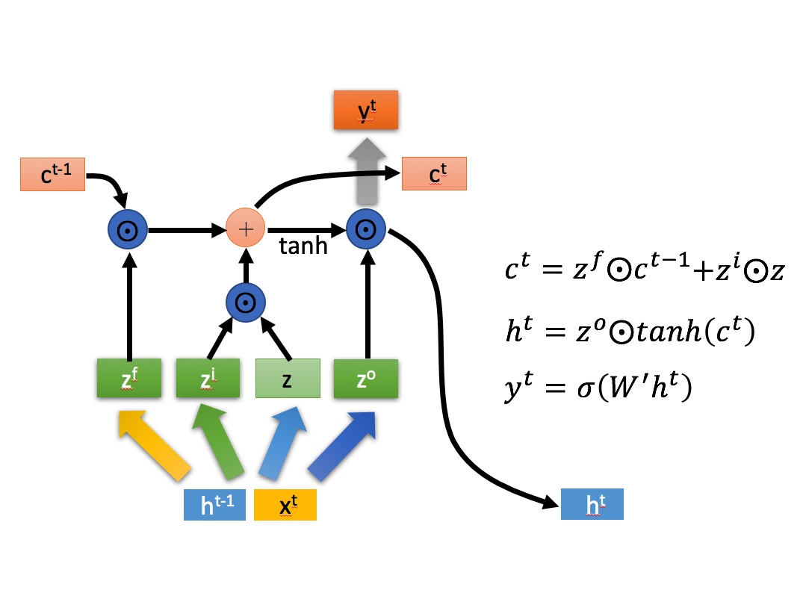

# LSTM

## RNN

RNN (Recurrent Neural Network，循环神经网络) 的简图如下，

RNN其中一个单元的细节如下图，

$x$ 为当前状态下数据的输入，  $h$  表示接收到的上一个节点的输入。

$y$  为当前节点状态下的输出，而   $h'$ 为传递到下一个节点的输出。

通过上图的公式可以看到，输出 $h'$ 与  $x$ 和  $h$ 的值都相关。

而  $y$  则常常使用 $h'$ 投入到一个线性层（主要是进行维度映射）然后使用 softmax 进行分类得到需要的数据。对这里的 $y$ 如何通过 $h'$ 计算得到往往看具体模型的使用方式。

通过序列形式的输入，我们能够得到如下形式的RNN。

RNN的主要特点是可以处理序列化数据，比如某个单词的意思会因为上文提到的内容不同而有不同的含义。在过去几年中，应用 RNN 在语音识别，语言建模，翻译，图片描述等问题上已经取得一定成功，并且这个趋势还在增长。

但是对于一些比较复杂的场景，比如我们试着去预测“I grew up in France... I speak fluent French”最后的词。当前的信息建议下一个词可能是一种语言的名字，但是如果我们需要弄清楚是什么语言，我们是需要先前提到的离当前位置很远的 France 的上下文的。这说明相关信息和当前预测位置之间的间隔就肯定变得相当的大。在这个间隔不断增大时，RNN 会丧失学习到连接如此远的信息的能力。

## LSTM

### LSTM和RNN的区别

LSTM (Long Short Term)是一种 RNN 特殊的类型，可以学习长期依赖信息，解决了RNN中间隔变大丧失学习能力的问题。

LSTM结构 (右) 和RNN的主要区别如下图所示

相比RNN只有一个传递状态  $h^t$，LSTM有两个传输状态，  $c^t$ (cell state) 和 $h^t$ (hidden state)。(Tips：RNN中的 $h^t$ 对应于LSTM中的 $c^{t}$)。其中对于传递下去的  $c^{t}$ 改变得很慢，通常输出的 $c^{t}$ 是上一个状态传过来的 $c^{t-1}$ 加上一些数值。而  $h^t$  则在不同节点下往往会有很大的区别。

### LSTM的结构剖析
LSTM的整体结构及其中一个单元的结构如下

其中，$z$、$z^i$、$z^f$、$z^o$，是由拼接向量乘以权重矩阵之后，再通过激活函数获取的值。$z^i$、$z^f$、$z^o$ 对应的激活函数是 $sigmoid$，而 $z$ 对应的激活函数是 $tanh$，$z$ 使用 $tanh$ 是因为这里是将其作为输入数据，而不是门控信号。

![[公式]](https://www.zhihu.com/equation?tex=%5Codot)  是Hadamard Product，也就是操作矩阵中对应的元素相乘，因此要求两个相乘矩阵是同型的。 ![[公式]](https://www.zhihu.com/equation?tex=%5Coplus)  则代表进行矩阵加法。

LSTM内部主要有三个阶段：
1. 忘记阶段。这个阶段主要是对上一个节点传进来的输入进行**选择性**忘记。简单来说就是会 “忘记不重要的，记住重要的”。
具体来说是通过计算得到的  $z^f$ ($f$ 表示forget) 来作为忘记门控，来控制上一个状态的$c^{t-1}$ 哪些需要留哪些需要忘。

2. 选择记忆阶段。这个阶段将这个阶段的输入有选择性地进行“记忆”。主要是会对输入 $x^t$ 进行选择记忆。哪些重要则着重记录下来，哪些不重要则少记一些。当前的输入内容由前面计算得到的 $z$ 表示。而选择的门控信号则是由 $z^i$ ($i$ 代表 information) 来进行控制。将上面两步得到的结果相加，即可得到传输给下一个状态的 $c^t$。也就是上图中的第一个公式。

3. 输出阶段。这个阶段将决定哪些将会被当成当前状态的输出。主要是通过 $z^o$ 来进行控制的。并且还对上一阶段得到的 $c^o$ 进行了放缩 (通过一个tanh激活函数进行变化)。与普通RNN类似，输出 $y^t$ 往往最终也是通过  $h^t$ 变化得到。
<!--stackedit_data:
eyJoaXN0b3J5IjpbLTQ3NzQ3NDc0NCwtMjAzNjY2MDc1MywtND
QwMTA5OTQ4LDE2OTUyMzU3NzQsMzk5NjkzNzg4LC0zNDA1ODQ1
MjgsLTE4NDgyNzg1MjYsMTk2Mzk0OTUyNCwxMTI4MDA4OTE2LC
04Njk1Mjg5NzFdfQ==
-->