# LSTM

## RNN

RNN (Recurrent Neural Network，循环神经网络) 的简图如下，

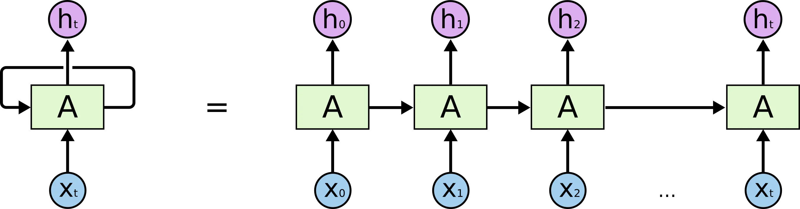

RNN其中一个单元的细节如下图，

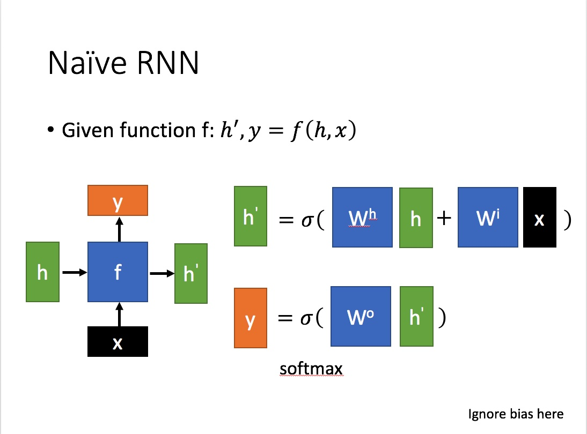

$x$ 为当前状态下数据的输入，  $h$  表示接收到的上一个节点的输入。

$y$  为当前节点状态下的输出，而   $h'$ 为传递到下一个节点的输出。

通过上图的公式可以看到，输出 $h'$ 与  $x$ 和  $h$ 的值都相关。

而  $y$  则常常使用 $h'$ 投入到一个线性层（主要是进行维度映射）然后使用 softmax 进行分类得到需要的数据。对这里的 $y$ 如何通过 $h'$ 计算得到往往看具体模型的使用方式。

通过序列形式的输入，我们能够得到如下形式的RNN。

RNN的主要特点是可以处理序列化数据，比如某个单词的意思会因为上文提到的内容不同而有不同的含义。在过去几年中，应用 RNN 在语音识别，语言建模，翻译，图片描述等问题上已经取得一定成功，并且这个趋势还在增长。

但是对于一些比较复杂的场景，比如我们试着去预测“I grew up in France... I speak fluent French”最后的词。当前的信息建议下一个词可能是一种语言的名字，但是如果我们需要弄清楚是什么语言，我们是需要先前提到的离当前位置很远的 France 的上下文的。这说明相关信息和当前预测位置之间的间隔就肯定变得相当的大。在这个间隔不断增大时，RNN 会丧失学习到连接如此远的信息的能力。

## LSTM

### LSTM和RNN的区别

LSTM (Long Short Term)是一种 RNN 特殊的类型，可以学习长期依赖信息，解决了RNN中间隔变大丧失学习能力的问题。

LSTM结构 (右) 和RNN的主要区别如下图所示

相比RNN只有一个传递状态  $h^t$，LSTM有两个传输状态，  $c^t$ (cell state) 和 $h^t$ (hidden state)。(Tips：RNN中的 $h^t$ 对应于LSTM中的 $c^{t}$)。其中对于传递下去的  $c^{t}$ 改变得很慢，通常输出的 $c^{t}$ 是上一个状态传过来的 $c^{t-1}$ 加上一些数值。而  $h^t$  则在不同节点下往往会有很大的区别。

### LSTM的结构剖析
LSTM的整体结构及其中一个单元的结构如下

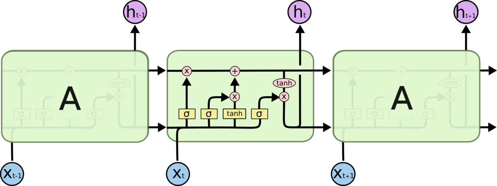

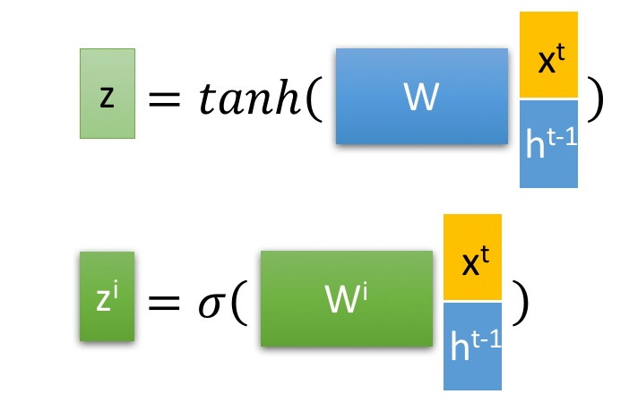
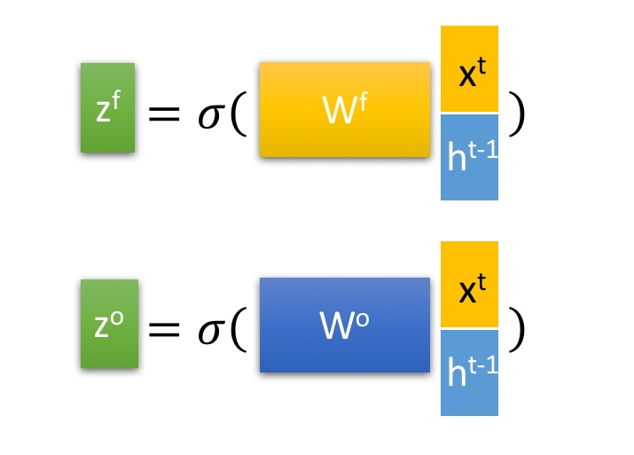
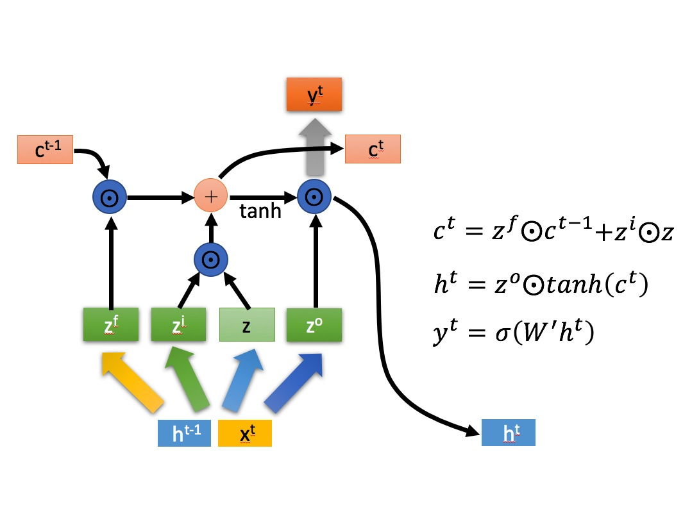

其中，$z$、$z^i$、$z^f$、$z^o$，是由拼接向量乘以权重矩阵之后，再通过激活函数获取的值。$z^i$、$z^f$、$z^o$ 对应的激活函数是 $sigmoid$，而 $z$ 对应的激活函数是 $tanh$，$z$ 使用 $tanh$ 是因为这里是将其作为输入数据，而不是门控信号。

![[公式]](https://www.zhihu.com/equation?tex=%5Codot)  是Hadamard Product，也就是操作矩阵中对应的元素相乘，因此要求两个相乘矩阵是同型的。 ![[公式]](https://www.zhihu.com/equation?tex=%5Coplus)  则代表进行矩阵加法。

LSTM内部主要有三个阶段 (三个门)：
1. 忘记阶段。这个阶段主要是对上一个节点传进来的输入进行选择性**忘记**。简单来说就是会“忘记不重要的，记住重要的”。
具体来说是通过计算得到的 $z^f$ ($f$ 表示forget) 来作为忘记门控，来控制上一个状态的$c^{t-1}$ 哪些需要留哪些需要忘。

2. 选择记忆阶段。这个阶段将这个阶段的输入有选择性地进行**记忆**。主要是会对输入 $x^t$ 进行选择记忆。哪些重要则着重记录下来，哪些不重要则少记一些。当前的输入内容由前面计算得到的 $z$ 表示。而选择的门控信号则是由 $z^i$ ($i$ 代表 information) 来进行控制。将上面两步得到的结果相加，即可得到传输给下一个状态的 $c^t$。也就是上图中的第一个公式。

3. 输出阶段。这个阶段将决定哪些将会被当成当前状态的**输出**。主要是通过 $z^o$ 来进行控制的。并且还对上一阶段得到的 $c^o$ 进行了放缩 (通过一个tanh激活函数进行变化)。与普通RNN类似，输出 $y^t$ 往往最终也是通过 $h^t$ 变化得到。

### Source Code

首先，我们在添加 lstm 的 layer 时，调用语句是 

`nn.LSTM(input_size, hidden_size, num_layers, batch_first)`

实际上就是调用的 torch/nn/modules/rnn.py 中的 class LSTM，LSTM 继承了 RNNBase。所以我们首先看这个基类

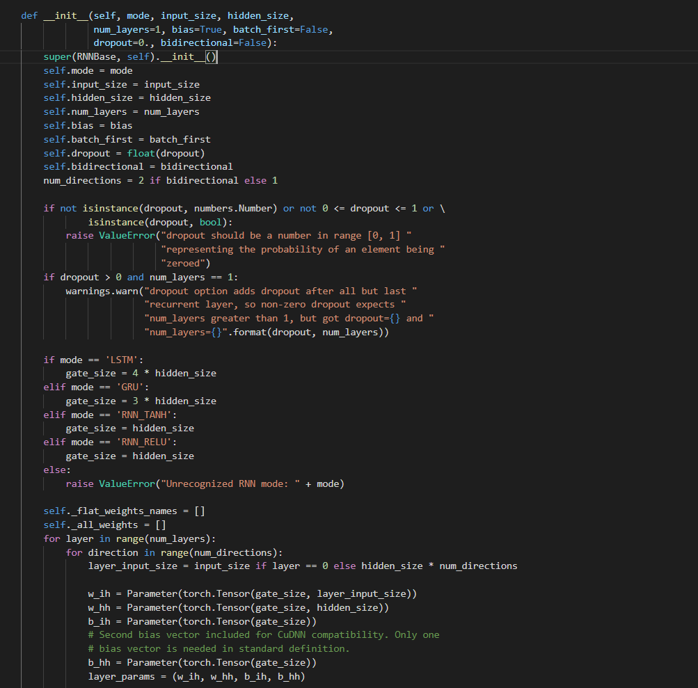

对于 LSTM 的 gate_size = 4 * hidden_size，是因为 lstm 是将 4 路数据流向一并进行计算的。具体我们可以看一个基本 lstm 单元的 forward 的计算，参考 aten/src/Aten/native/RNN.cpp，如下图

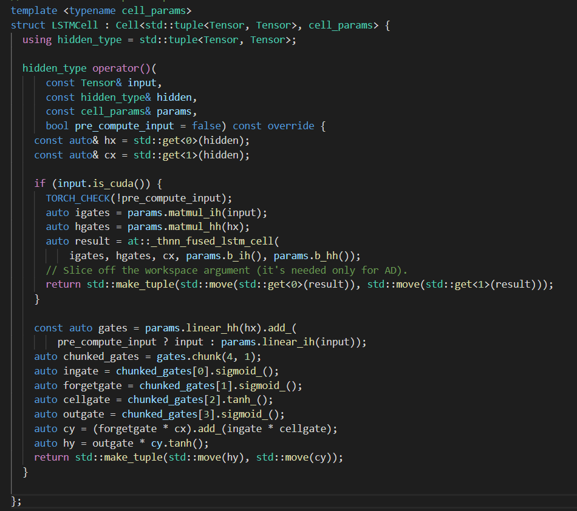

接下来再看基类进行初始化时对 layer_input_size 的赋值，如果不是第一层时，layer_input_size = hidden_size，这个是跟 lstm 组合时的结构有关系，如下图所示

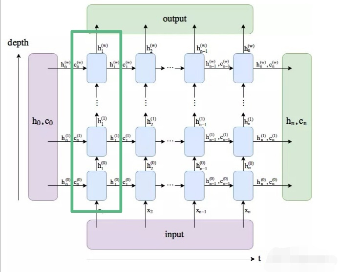

蓝色小方框就是一个 lstm cell，绿色长方框内蓝色方框的个数就是设定的 num_layers。当 layer>1 时，当前 layer 的输入就是上一 layer 的 output 即 hidden 输出，在 c++ 层面的 output 是等于 hidden 的。在训练或预测时，lstm 的 c++ 调用入口为

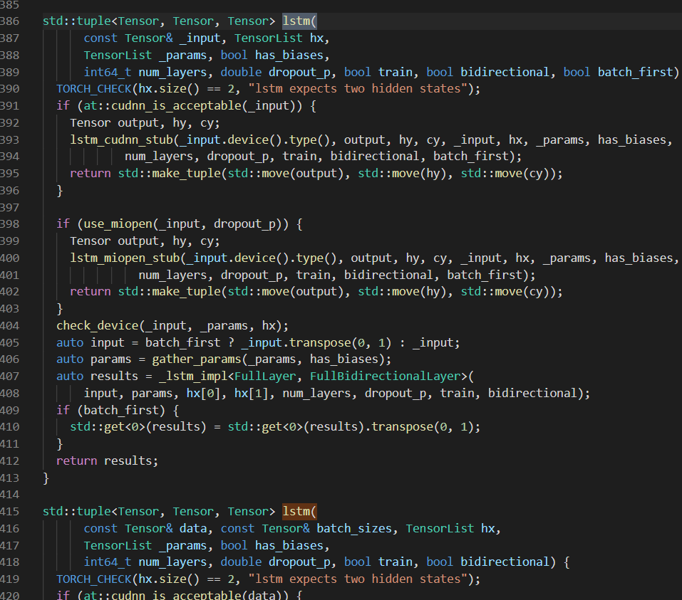

通过这个接入口可以相应一步步了解整个算子的细节，[这里](https://zhuanlan.zhihu.com/p/63638656)也有一些可参考的内容。具体调用哪个和 rnn.py 中 forward 的这里有关系

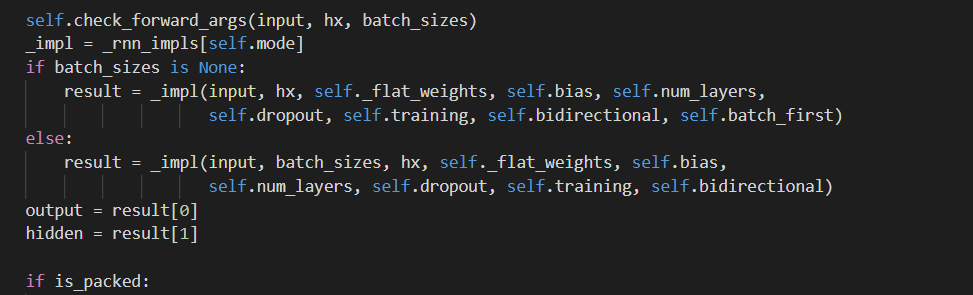

### 变体

#### 双向 LSTM

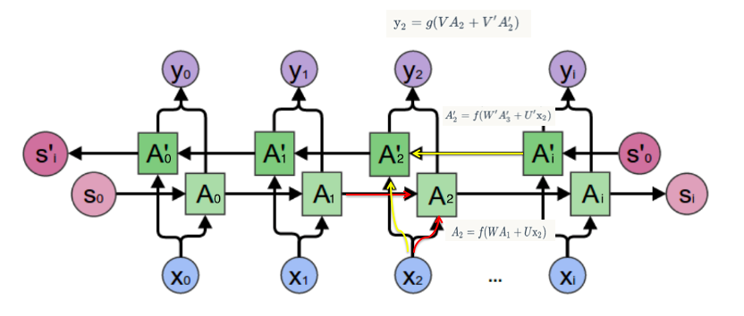

正向计算时，隐藏层的 $h_t$ 与 $h_{t-1}$ 有关；反向计算时，隐藏层的 $h_t$ 与 $h_{t+1}$ 有关，这样的话，网络的参数量是原来的 2 倍。

#### Peephole

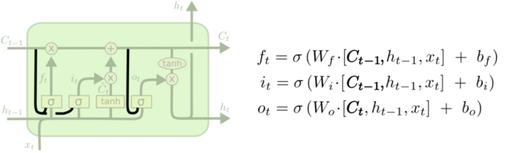

[论文](http://www.jmlr.org/papers/volume3/gers02a/gers02a.pdf)。这里三条黑线就是所谓的 peephole，传统的 LSTM 中遗忘门、输入门和输出门只用了 h(t-1) 和 xt 来控制门缝的大小，peephole 的意思是说不但要考虑 h(t-1) 和 xt，也要考虑 Ct-1 和 Ct，其中遗忘门和输入门考虑了 Ct-1，而输出门考虑了 Ct。

#### Coupled Input and Forget

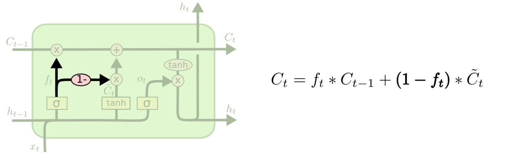

将遗忘门与选择门结合成一个门。

#### GRU

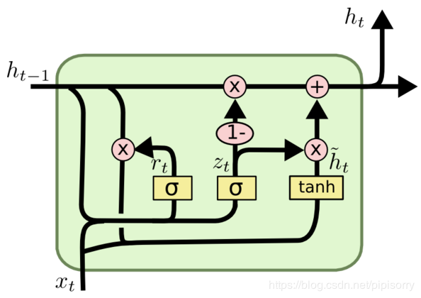

[GRU](https://arxiv.org/pdf/1406.1078v3.pdf) 中只包含两个门 $r_t$ 重置门 (reset)，和 $z_t$ 更新门 (update)。其实 $z_t$ 对应 lstm 中的 $z_i$ 选择门，用于选择将多少输入信息 ($\widetilde h_t$) 放进最终的输出中，同时 $1-z_t$ 又充当了遗忘门，即对上一阶段的输出 $h_{t-1}$ 进行选择性忘记。

GRU 是目前用的比较多的变体之一，pytorch 也给了相应支持。再回到最初 RNNBase 的 init 中，当 mode == 'GRU' 时，gate_size = 3 * hidden_size，这里少了一个门，刚好能对应上。

### 总结
以上，就是 LSTM 的内部结构。通过门控状态来控制传输状态，记住需要长时间记忆的，忘记不重要的信息；而不像普通的RNN那样只能够用仅有一种记忆叠加方式。LSTM 对很多需要“长期记忆”的任务来说，尤其好用。

但也因为引入了很多内容，导致参数变多，也使得训练难度加大了很多。因此很多时候我们往往会使用效果和LSTM相当但参数更少的GRU来构建大训练量的模型。
<!--stackedit_data:
eyJoaXN0b3J5IjpbNzg4NDUwOTg3LC0xODI0MTIzNzQ3LC00Nz
c0NzQ3NDQsLTIwMzY2NjA3NTMsLTQ0MDEwOTk0OCwxNjk1MjM1
Nzc0LDM5OTY5Mzc4OCwtMzQwNTg0NTI4LC0xODQ4Mjc4NTI2LD
E5NjM5NDk1MjQsMTEyODAwODkxNiwtODY5NTI4OTcxXX0=
-->