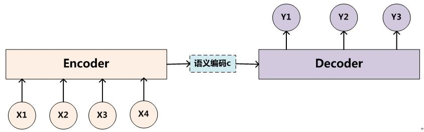
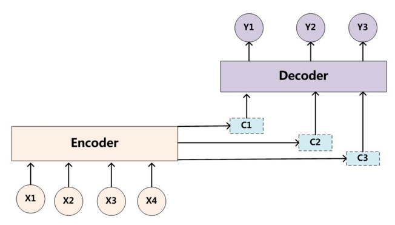
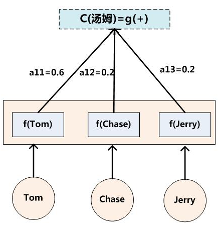
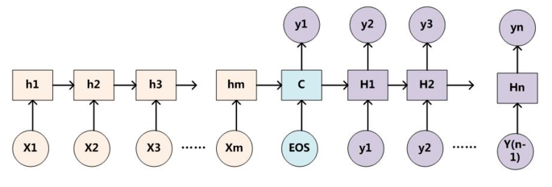
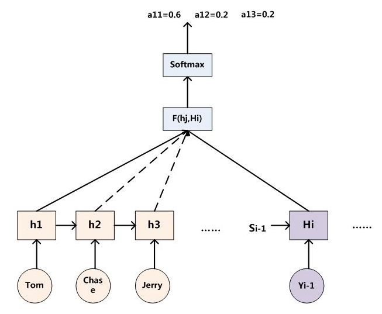
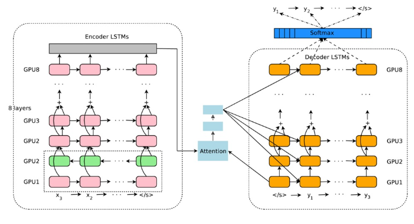

# Attention

当人们注意到某个目标或某个场景时，该目标内部以及该场景内每一处空间位置上的注意力分布是不一样的。对于图片，会有些特别显眼的场景会率先吸引住注意力，那是因为脑袋中对这类东西很敏感。对于文本，我们大都是带目的性的去读，顺序查找，顺序读，但是在理解的过程中，我们是根据我们自带的目的去理解，去关注的。 注意力模型 (AM) 应该与具体的目的(或者任务)相结合。

从 Attention 的作用角度出发，我们就可以从两个角度来分类 Attention 种类：Spatial Attention 空间注意力和 Temporal Attention 时间注意力。更具实际的应用，也可以将 Attention 分为 Soft Attention 和 Hard Attention。Soft Attention 是所有的数据都会注意，都会计算出相应的注意力权值，不会设置筛选条件。Hard Attention 会在生成注意力权重后筛选掉一部分不符合条件的注意力，让它的注意力权值为 0，即可以理解为不再注意这些不符合条件的部分。

## Encoder-Decoder 框架

目前绝大多数的 AM 是附在 Encoder-Decoder 之下的。但是，需要注意的是 AM 可以看作一种通用的思想，并不依赖于 Encoder-Decoder 之中。Encoder-Decoder 框架可以看作一种文本处理领域的研究模式，应用场景异常广泛，本身也很值得深入研究。

    
     
        抽象的 Encoder-Decoder 框架

Encoder-Decoder 框架可以这么直观地理解为处理由一个句子（或篇章）生成另外一个句子（或篇章）的通用模型。对于句子对 $<X,Y>$，可以理解为 $X$ 是汉语句子，Y是汉语句子的英文翻译，等等。我们的目标是给定输入句子 $X$，期待通过 Encoder-Decoder 框架来生成目标句子 $Y$。$X$ 和 $Y$ 可以是同一种语言，也可以是两种不同的语言。而 $X$ 和 $Y$ 分别由各自的单词序列构成：

$X = <x_1, x_2, ... x_i, ... x_n>$
$Y = <y_1, y_2, ... y_j, ... y_m>$

Encoder 顾名思义就是对输入句子X进行编码，将输入句子通过非线性变换转化为中间语义表示 $C$：

$C = F(X)$

对于解码器 Decoder 来说，其任务是根据句子 X 的中间语义表示 C 和之前已经生成的历史信息 $y_1$, $y_2$, … $y_{i-1}$ 来生成 $i$ 时刻要生成的单词 $y_i$ ：

$y_i = G(C, y_1, y_2, ... y_{i-1})$

每个 $y_i$ 都依次这么产生，那么看起来就是整个系统根据输入句子 $X$ 生成了目标句子 $Y$。其实这里的 Encoder-Decoder 是一个序列到序列的模型 seq2seq，这个模型是对顺序有依赖的。以英语翻译为例理解 Encoder-Decoder 模型，课本上的单词和课文是原始数据输入，相当于 $X$，我在大脑里加工这些数据，相当于 Encoder 模型，我的脑子里有很多加工后的数据，相当于 $C$，现在要让我翻译为英语句子，这个任务最终输出的英语句子相当于 $Y$，翻译过程中借助我脑袋里加工后的数据 $C$ 去翻译这个句子，即我得动脑子，相当于 Decoder。 学习的过程是什么都要学，要分类整理，要增加线索，并不知道未来的某天能用到什么，所以Encoder-Decoder 是一个泛泛学习的框架。

## Attention Model

Encoder-Decoder 模型是没有体现出“注意力模型”的，所以可以把它看作是注意力不集中的分心模型。为什么说它注意力不集中呢？观察下目标句子 $Y$ 中每个单词的生成过程如下：

$y_1 = f(C)$
$y_2 = f(C, y_1)$
$y_3 = f(C, y_1, y_2)$

其中 f 是 Decoder 的非线性变换函数。原始的 Decoder 生成每个单词 ($y_1$，$y_2$，$y_3$) 时使用的句子 $X$ 的语义编码 $C$ 没有任何区别。而语义编码 $C$ 是由句子 $X$ 的每个单词经过 Encoder 产生的，这意味着不论是生成哪个单词，$y_1$，$y_2$，还是 $y_3$，句子 $X$ 中任意单词对生成某个目标单词 $y_i$ 来说影响力都是相同的，没有任何区别(其实如果 Encoder 是 RNN 类的话，理论上越是后输入的单词影响越大，并非等权的，估计这也是为何 Google 提出 Sequence to Sequence 模型时发现把输入句子逆序输入做翻译效果会得到更好的小 Trick 的原因)，这就是为何说这个模型没有体现出注意力的缘由。

引入 AM 模型，以翻译一个英语句子举例：输入 $X$：Tom chase Jerry。 理想输出：汤姆追逐杰瑞。应该在翻译“杰瑞”的时候，体现出英文单词对于翻译当前中文单词不同的影响程度，比如给出类似下面一个概率分布值：

（Tom,0.3）（Chase,0.2）（Jerry,0.5）

每个英文单词的概率代表了翻译当前单词“杰瑞”时，注意力分配模型分配给不同英文单词的注意力大小。这对于正确翻译目标语单词肯定是有帮助的，因为引入了新的信息。同理，目标句子中的每个单词都应该学会其对应的源语句子中单词的注意力分配概率信息。这意味着在生成每个单词 $y_i$ 的时候，原先都是相同的中间语义表示 $C$ 会替换成根据当前生成单词而不断变化的 $C_i$。理解 AM 模型的关键就是这里，即由固定的中间语义表示 $C$ 换成了根据当前输出单词来调整成加入注意力模型的变化的 $C_i$。

    
     
        引入 AM 模型的 Encoder-Decoder 框架

目标句子 $Y$ 中每个单词的生成过程转换成如下公式：

$y_1 = f(C_1)$
$y_2 = f(C_2, y_1)$
$y_3 = f(C_3, y_1, y_2)$

每个 $C_i$ 可能对应着不同的源句子单词的注意力分配概率分布，比如对于上面的英汉翻译来说，其对应的信息可能如下：

$C_1 = G(0.6f_2("Tom"), 0.2f_2("chase"), 0.2f_2("Jerry"))$ 
$C_2 = G(0.2f_2("Tom"), 0.7f_2("chase"), 0.1f_2("Jerry"))$ 
$C_3 = G(0.3f_2("Tom"), 0.2f_2("chase"), 0.5f_2("Jerry"))$ 

其中，$f_2$ 函数代表 Encoder 对输入英文单词的某种变换函数，比如如果 Encoder 是用的 RNN 模型的话，这个$f_2$ 函数的结果往往是某个时刻输入 $x_i$ 后隐层节点的状态值；$G$ 代表 Encoder 根据单词的中间表示合成整个句子中间语义表示的变换函数，一般的做法中，$G$ 函数就是对构成元素加权求和，也就是常常在论文里看到的下列公式：

$C_i = \sum_{j=1}^{T_x}{\alpha _{ij} h_j}$

对于 "Tom chase Jerry" 这个问题来说，$T_x$ 的值为 3，而 $\alpha _{11} = 0.6, \alpha _{12} = 0.2, \alpha _{13} = 0.2$，$h_1 = f_2("Tom"), h_2 = f_2("chase"), h_3 = f_2("Jerry")$。

    
     
        Ci 的生成过程

而以上注意力概率 $\alpha _{ij}$ 的获取就是通过 AM 模型来实现的。我们看以 RNN 为具体模型的 Encoder-Decoder 框架

    
     
        以 RNN 为具体模型的 Encoder-Decoder 框架

那么其对应的 AM 模型如下，

    
     
        以 RNN 为具体模型的 Encoder-Decoder 框架

对于采用 RNN 的 Decoder 来说，如果要生成 $y_i$ 单词，在时刻 $i$，我们是可以知道在生成 $y_i$ 之前的隐层节点 $i$ 时刻的输出值 $H_i$ 的，而我们的目的是要计算生成 $y_i$ 时的输入句子单词“Tom”、“Chase”、“Jerry”对 $y_i$ 来说的注意力分配概率分布，那么可以用 $i$ 时刻的隐层节点状态 $H_i$ 去一一和输入句子中每个单词对应的 RNN 隐层节点状态 $h_j$ 进行对比，即通过函数 $F(h_j, H_i)$ 来获得目标单词 $y_i$ 和每个输入单词对应的对齐可能性，这个 $F$ 函数在不同论文里可能会采取不同的方法，然后函数 $F$ 的输出经过 Softmax 进行归一化就得到了符合概率分布取值区间的注意力分配概率分布数值（这就得到了注意力权重）。上图显示的是当输出单词为“汤姆”时刻对应的输入句子单词的对齐概率。绝大多数 AM 模型都是采取上述的计算框架来计算注意力分配概率分布信息，区别只是在 $F$ 的定义上可能有所不同，大多数情况下，$F$ 为乘积计算。

上述内容就是论文里面常常提到的 Soft AM（任何数据都会给一个权值，没有筛选条件）的基本思想，你能在文献里面看到的大多数AM模型基本就是这个模型，区别很可能只是把这个模型用来解决不同的应用问题。那么怎么理解 AM 模型的物理含义呢？一般文献里会把 AM 模型看作是单词对齐模型，这是非常有道理的。目标句子生成的每个单词对应输入句子单词的概率分布可以理解为输入句子单词和这个目标生成单词的对齐概率，这在机器翻译语境下是非常直观的：传统的统计机器翻译一般在做的过程中会专门有一个短语对齐的步骤，而注意力模型其实起的是相同的作用。在其他应用里面把 AM 模型理解成输入句子和目标句子单词之间的对齐概率也是很顺畅的想法。

    
     
        Google 翻译神经网络模型

如图所示即为 Google 于 2016 年部署到线上的基于神经网络的机器翻译系统，相对传统模型翻译效果有大幅提升，翻译错误率降低了 60%，其架构就是上文所述的加上 Attention 机制的 Encoder-Decoder 框架，主要区别无非是其 Encoder 和 Decoder 使用了 8 层叠加的LSTM模型。

Hard Attention 是一个随机的过程。Hard Attention 不会选择整个 Encoder 的输出做为其输入，Hard Attention 会依概率 $S_i$ 来采样输入端的隐状态一部分来进行计算，而不是整个 Encoder 的隐状态。为了实现梯度的反向传播，需要采用蒙特卡洛采样的方法来估计模块的梯度。

主要参考

[https://www.cnblogs.com/ydcode/p/11038064.html](https://www.cnblogs.com/ydcode/p/11038064.html)

[https://www.cnblogs.com/guoyaohua/p/9429924.html](https://www.cnblogs.com/guoyaohua/p/9429924.html)

## Self Attention

我们可以将 Attention 的问题看作 Query，Key，Value 的问题，求解权重实际上就是计算 $Query*Key^T*Value$ 的过程。只不过 Key 和 Value 的值是相同的，即上一节中的 $h_j$，Query 即为 $H_i$。

上部分介绍的 Attention 中的 Query 来自于 Decoder 的隐藏层，而 Self Attention 的 Query 来自于自己本身，也就是 Query、Key、Value 的值相同。