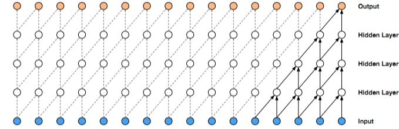

# WaveNet

[论文](https://arxiv.org/pdf/1609.03499.pdf)

## Casual Convolution

处理序列问题（即要考虑时间问题）时，不能使用普通的 CNN 卷积，必须使用添加时间序列逻辑的新的 CNN 模型，这个就是因果卷积的作用，看下面一个公式，对与序列问题（sequence modeling），主要抽象为，根据x1......xt和y1.....yt-1去预测yt，使得yt接近于实际值

$p(X) = \prod_{t=0}^Tp(x_t|x_1, x_2, ... , x_{t-1})$

 
图1 因果卷积

上面的图片展示的就是因果卷积，但是问题就来，如果要考虑很久之前的变量 x，那么增加卷积层数或者改用 shape 很大的卷积核来增大感受野，由此就会带来：梯度消失，训练复杂，拟合效果不好的问题，为了决绝这个问题，出现了扩展卷积（dilated）。

WaveNet 是利用扩大卷积来增加感受野。扩大卷积（dilated convolution）是通过跳过部分输入来使卷积核可以应用于大于卷积核本身长度的区域，等同于通过增加零来使原始卷积核生成更大的卷积核。扩大因果卷积的整体结构如图 2 所示。

 
图2 扩大因果卷积

